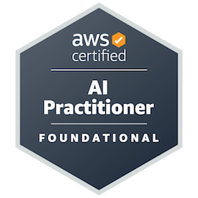
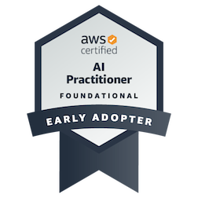
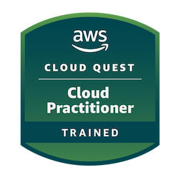

# 👋 Hey, I'm Ritik!

### 🐍 Python Developer | 🌩️ Cloud Enthusiast | 🏗️ Aspiring Solution Architect  

---

## 🚀 About Me  
- 🌱 Currently mastering **Python, AI, and Graph Databases**  
- ☁️ Passionate about optimizing infrastructure  &  **reducing cloud bills** 
- 🔧 Backend Engineer with strong foundations in **Computer Networks**  
- 🛠️ Love building with **Python, Docker, and AWS**  
- 💡 Lifelong learner exploring **cutting-edge cloud & AI solutions**  

---

## 🛠️ Tech Stack  
- **Languages**: Python  
- **Frameworks**: Flask, Django, FastAPI  
- **Tools & Platforms**: Docker, AWS, GitHub  
- **Domains**: Backend Engineering, Cloud Computing, Networking, DevOps  

---

## 🏅 Certifications  

## 📫 Connect with Me  
- 🐦 X: [@ritikshub](https://x.com/ritikshub)  

---

## 👀 Visitors Counter  
  

---

## 💡 Quote to Live By  
> *"The best way to predict the future is to create it."* — Peter Drucker  

